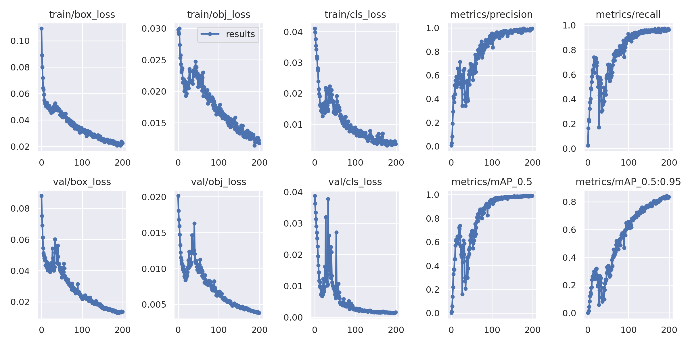
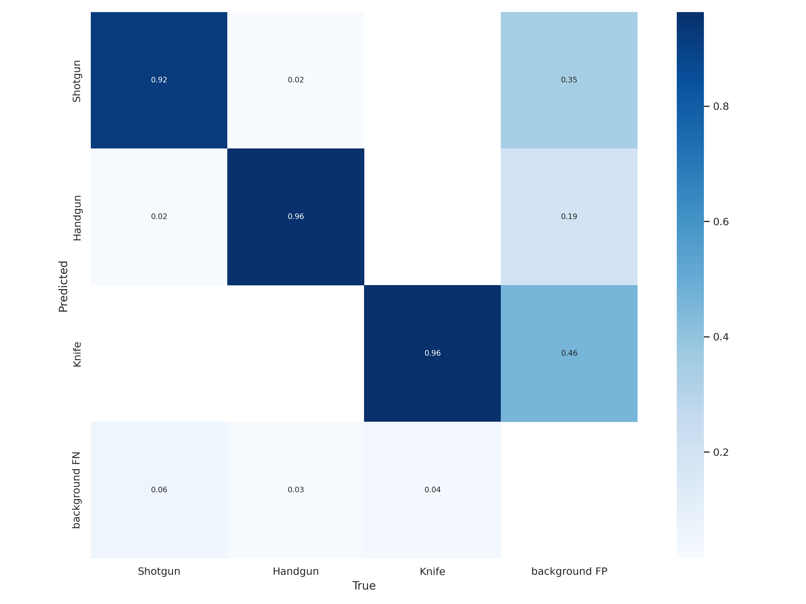

# YOLOv5-train-on-custom-data
In this project we develop a YOLOv5 based object detection model for "Shotgun", "Handgun", and "Knife". You can easily create your own data from [Open Images](https://storage.googleapis.com/openimages/web/index.html) and run this repo on your own custom data.  

## Dataset

The images for this project were collected from [Open Images](https://storage.googleapis.com/openimages/web/index.html) using this toolkit [OIDv4](https://github.com/EscVM/OIDv4_ToolKit)

## Training results

* Model performance
    

* Confusion matrix  
    
## Acknowledgement

The project has been developed based on the following resourses:
- [YOLOv5 official github repository](https://github.com/ultralytics/yolov5) 
- [Convert annotations by theAIGuysCode](https://github.com/theAIGuysCode/OIDv4_ToolKit/blob/master/convert_annotations.py)
- [~ OIDv4 ToolKit ~](https://github.com/EscVM/OIDv4_ToolKit)

